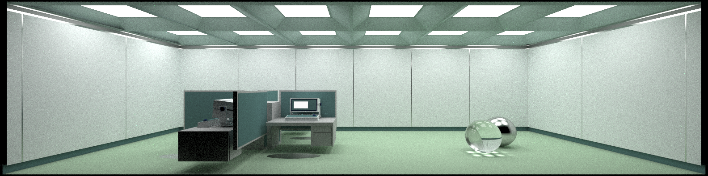

# Ray Tracer in Rust

<!--  -->

A physically based Monte Carlo path tracer implemented entirely using Rust, based on Peter Shirley's _Ray Tracing in One Weekend_ series, this project serves as both a learning tool for Rust and a engine for generating high-quality rendered images.

Includes CLI commands that allow you to modify the selected scene and camera configurations (for example, target, width, field of view, etc.).

> [!NOTE]
> This project runs solely on the CPU—all ray computations are executed on the CPU (no GPU acceleration).

## Installation

### Prerequisites

  [](https://www.rust-lang.org)
  [](https://doc.rust-lang.org/cargo/)
  
### Building and Running the Project

Clone the repository and build in release mode for best performance:

```bash
git clone https://github.com/gdicosimo/ray_tracer
cd ray_tracing
cargo build --release
```

After building, you can run the executable directly:

```bash
target/release/ray_tracer
```

Alternatively, you can build and run in one step:

```bash
git clone https://github.com/gdicosimo/ray_tracer
cd ray_tracer
cargo run --release
```

> [!TIP]
> Use the `--help` flag for more information about available CLI options.

## Example of Use

> [!IMPORTANT]
> Make sure you are in the project directory before running these commands.

### Basic Rendering

For example, you can run the ray tracer with custom scene and camera settings:

```bash
target/release/ray_tracer \
  --output render.png \
  --width 1920 \
  --aspect-ratio 1.77 \  
  # 1.77 is equivalent to 16:9 (1920/1.77 ≈ 1080 height)
  --samples_per_pixel 500 \  
  # Determines how many rays are sampled for each pixel
  --scene cornell_box
```

### Camera Configuration

Adjust camera settings via the CLI. For example:

```bash
cargo run --release -- \
  --scene cornell_box \
  --lookfrom 3,2,5 \      
  # Camera position (x,y,z)
  --lookat 0,0,0 \        
  # Focus point
  --vfov 60               
  # Vertical field of view (degrees)
```

### Scene Selection

Predefined scenes include:

- **cornell_box** (default) – a classic test scene for global illumination

- **svrnc** – a scene inspired by the Severance series

- **earth** – a view from space to Earth

- **rtiow** – a final scene from the _Ray Tracing in One Weekend_ series

All these scenes are rendered in the [assets/renders](assets/renders) folder inside the project.

Have fun!

## Acknowledgments

This implementation is based on the excellent "Ray Tracing in One Weekend" book series by Peter Shirley:

- [_Ray Tracing in One Weekend_](https://raytracing.github.io/books/RayTracingInOneWeekend.html)
- [_Ray Tracing: The Next Week_](https://raytracing.github.io/books/RayTracingTheNextWeek.html)
- [_Ray Tracing: The Rest of Your Life_](https://raytracing.github.io/books/RayTracingTheRestOfYourLife.html)

These books are available for free online and have been an excellent resource for understanding the fundamentals of ray tracing and physically based rendering.
